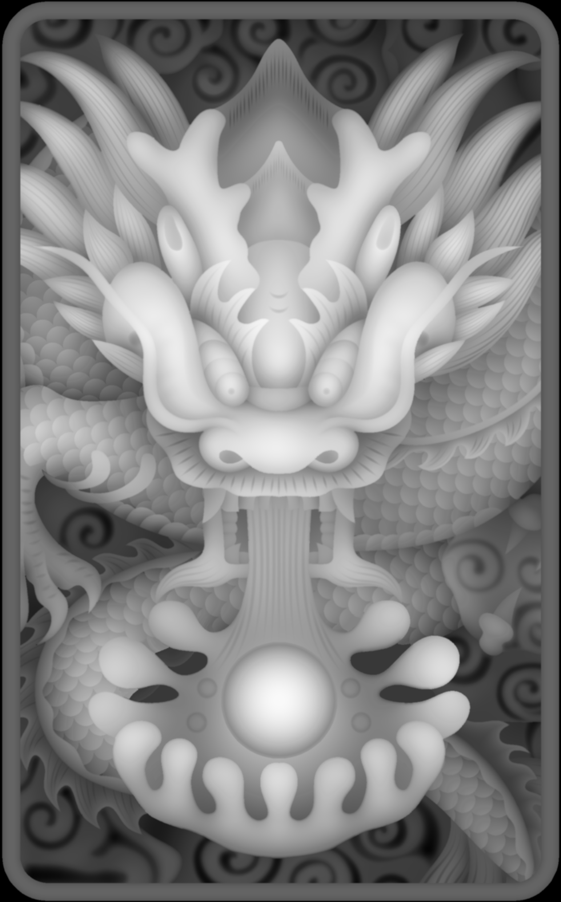

## ASCII:
（American Standard Code for Information Interchange）, is a character encoding standard for electronic communication.The ASCII character set originally used seven bits to represent each character, allowing for 128 unique characters. Later ASCII evolved so that all eight bits were used which allows for 256 characters.

美国标准代码交换信息的缩写，是电子通信的字符编码标准。ASCII代表美国的信息交换标准代码。ASCII字符集最初使用7位来表示每个字符，允许128个惟一字符。后来的ASCII码的演变使得所有的8位（256个字符）都被使用。

## 颜色

颜色或色彩是通过眼、脑和我们的生活经验所产生的一种对光的视觉效应。人对颜色的感觉不仅仅由光的物理性质所决定，还包含心理等许多因素，比如人类对颜色的感觉往往受到周围颜色的影响。有时人们也将物质产生不同颜色的物理特性直接称为颜色

红绿蓝三原色 (RGB)

RGB色彩立方体
发光的媒体（比如电视机）使用红、绿 和蓝加色的三元色，每种光尽可能只刺激针对它们的锥状细胞而不刺激其它的锥状细胞。这个系统的色域占人可以感受到的色彩空间的大部分，因此电视机和电脑萤幕使用这个系统。 
理论上我们也可以使用其他颜色作为元色，但使用红、绿和蓝我们可以最大地达到人的色彩空间。遗憾的是对于红、绿和蓝色没有固定的波长的定义，因此不同的技术仪器可能使用不同的波长从而在萤幕上产生稍微不同的颜色。 

青、洋红、黄、黑四元色 (CMYK)

CMYK色彩立方体

理论上，青色、洋红色和黄色半透明的颜料涂在白色的底上，颜料会结合而吸收所有光线，然后产生黑色。然而实际上会产生很暗的棕色。所以除了青色、洋红色和黄色之外，还会加入黑色以平衡色彩的偏差(即青、洋红、黄、黑CMYK)。 

色相、饱和度和明度系统 (HSB)
主条目：HSB
在制作计算机图像时人们往往使用另一种颜色系统。这个颜色系统使用三项分类，分别叫做色相（hue）、饱和度（saturation）和明度（brightness）的系数。色调决定到底哪一种颜色被使用，饱和度决定颜色的纯度，亮度决定颜色的明暗程度。 

'A'的ASCII码为41（十六进制）

unicode码为0041

无utf-8编码

'中'的unicode码为4e2d

utf8码为&#x4E2D

无ascii编码

## 黄色(yellow)的RGB编码是(255,255,0)

## 从网上下载一个 BMP 格式图像,用图片编辑工具另存在 jpg、 png、tiff 格式。问三种格式中,哪种格式显示质量好?相对于 BMP 格式,压缩率各是多少?

png质量最好

压缩率分别是7%，28%，54%

见图

bmp格式（原图）

jpg格式,压缩率7%

png格式，压缩率28%

tif格式(图未显示出来），压缩率54%

## winrar是无损压缩，lossless
