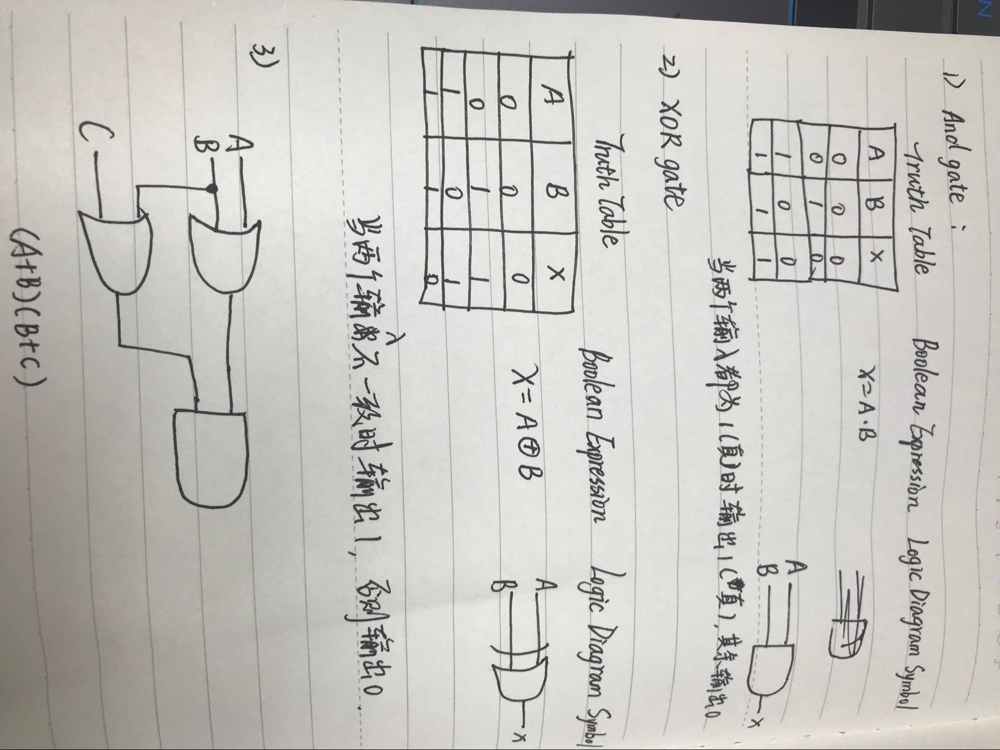
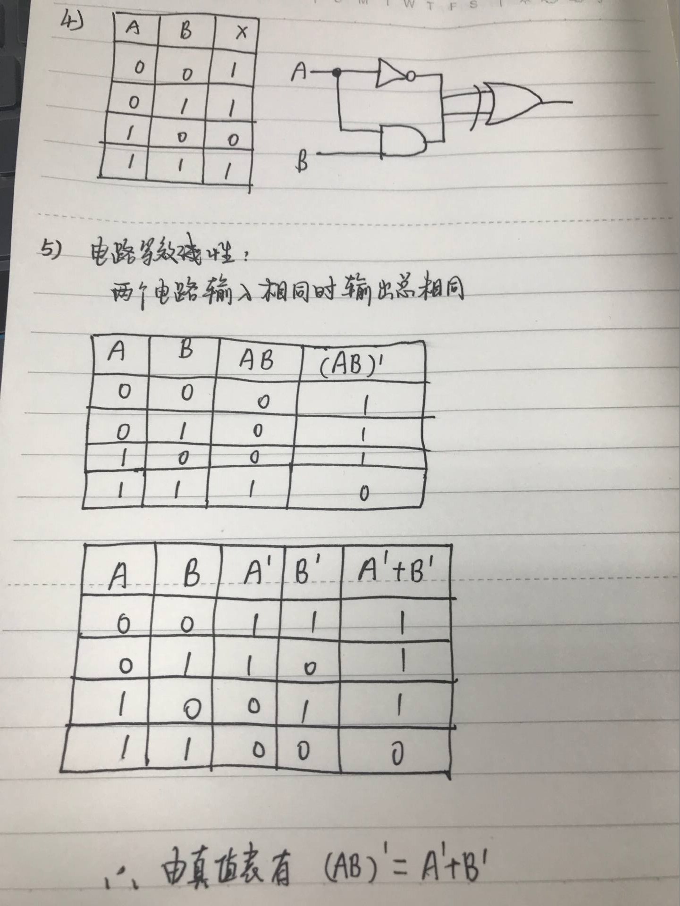
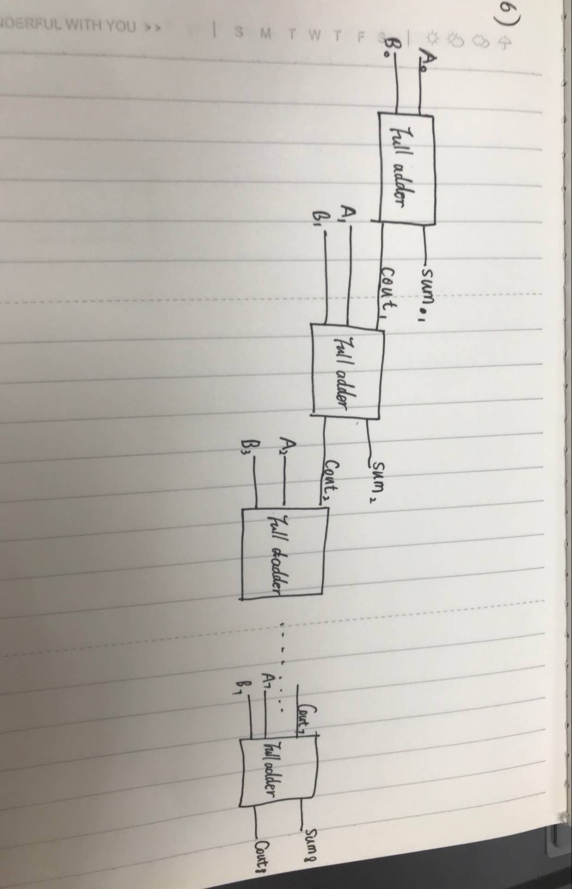
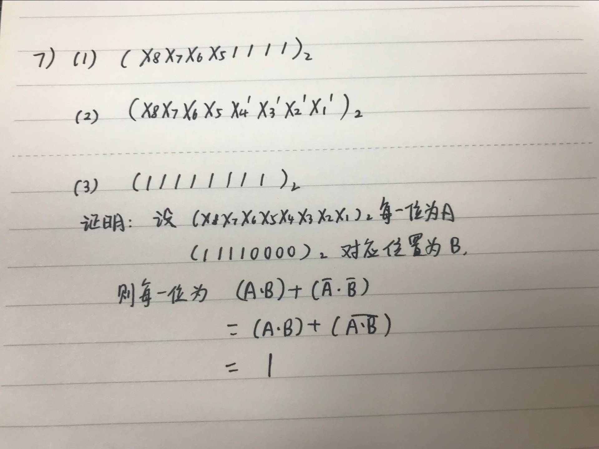

# part 1
如图

# part 2
如图

# part 3
## Logic gate 逻辑门

In electronics, a logic gate is an idealized or physical device implementing a Boolean function; that is, it performs a logical operation on one or more binary inputs and produces a single binary output.

在电子学中，逻辑门是实现布尔函数的理想或物理设备;也就是说，它对一个或多个二进制输入执行逻辑操作，并生成单个二进制输出。

## Boolean algebra 布尔代数

In mathematics and mathematical logic, Boolean algebra is the branch of algebra in which the values of the variables are the truth values true and false, usually denoted 1 and 0 respectively. 

在数学和数学逻辑中，布尔代数是代数的一个分支，其中变量的值为真值和假值，通常分别表示为1和0。

## Flip-flop 触发器

### 1)Flip-flop 中文翻译是

Flip-flop (electronics) – the bistable multivibrator, a circuit with two stable states
Flip-flop (programming) – a boolean expression with persistent state and two conditions

双稳态多谐振荡器，一种具有两种稳定状态的电路
触发器，一个具有持久状态和两个条件的布尔表达式。

### 2)How many bits information does a SR latch store?
一个S—R锁存器存储一个二进制数字