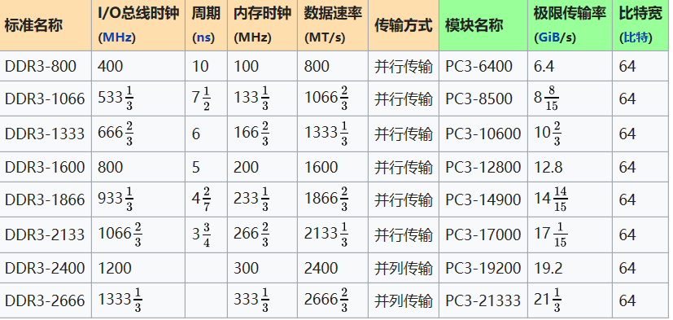

# 1、According to the von Neumann architecture, List basic parts of a computer.

## 1.存储器: 
计算机中的存储器按用途存储器可分为主存储器（内存）和辅助存储器（外存）

## 2.运算器

## 3.控制器

## 4.输入设备
如键盘鼠标

## 5.输出设备
如显示器，打印机

# 2、A computer has 64 MB (megabytes) of memory. How many bits are needed to address any single byte in memory?

log 2(64*2(10+10+10))=36 bits

# 3、List basic parts of a CPU, include cache or not? 

1.Arithmetic/Logic Unit(逻辑算术单元) 
2.Control unit(控制单元) 
ALU和控制单元称为中央处理器CPU

include cache

# 4、What mean secondary storage. List some on your PC.

Secondary Storage，二级存储器，指与来自主存储的存储器相连的辅助存储设备。 
如硬盘、光碟、闪存卡、U盘

# 5、使用维基百科，解释以下概念： 

## CPU 
A central processing unit (CPU) is the electronic circuitry within a computer that carries out the instructions of a computer program by performing the basic arithmetic, logical, control and input/output (I/O) operations specified by the instructions.  
中央处理单元(CPU)是计算机内部的电子电路，通过执行指令指定的基本算术、逻辑、控制和输入/输出(I/O)操作来执行计算机程序的指令

## RAM
Random-access memory (RAM /ræm/) is a form of computer data storage that stores data and machine code currently being used. A random-access memory device allows data items to be read or written in almost the same amount of time irrespective of the physical location of data inside the memory.  
随机访问存储器(RAM / ræm /)是一种计算机数据存储,存储数据,目前机器代码被使用。随机访问内存设备允许在几乎相同的时间内读取或写入数据项，而不管数据在内存中的物理位置如何

## ROM
Read-only memory, a type of storage media that is used in computers and other electronic devices 
只读存储器，用于计算机和其他电子设备的一种存储介质

## Bus (computing) 
attachment bus Serial Attached SCSI (SAS) and other serial SCSI buses Thunderbolt Yapbus, a proprietary bus developed for the Pixar Image Computer Computing portal.  
总线(计算机)连接总线串行连接SCSI (SAS)和其他串行SCSI总线Thunderbolt Yapbus，为皮克斯图像计算机计算门户开发的专有总线

## Parallel computing 
Parallel computing is a type of computation in which many calculations or the execution of processes are carried out simultaneously. 
并行计算是一种同时进行许多计算或过程执行的计算类型。

# 6、写一段文字，简单解释“云计算（cloud computing）

要解释云计算，要先解释“云”的概念。云到底是什么，简单的来说，云就是由很多计算机（不是PC）或服务器组成的一个庞大的计算机集群。 
云计算，就是将你的电脑或本地服务器上运行的程序或运算搬到这个由其他很多计算机组成的“计算机云”里去计算

# 7、小孙买了计算机主板，说明书表明“支持双通道DDR3-1333内存， 最大支持16G” 

## 1）DDR3内存，“3”和“1333”的含义是什么？
3表示第三代双倍数据率同步动态随机存取存储器 
1333表示数据速率为1333(1/3)MT/s 
如图
## 2）小孙买8G DDR3-1600的内存能提高性能吗？
不能，I/O总线时钟(MHz)不同
## 3）小孙买4G*2 DDR3-1333的内存能提高性能吗？
可以.
## 4）16G需要多少位地址？

需要log 2(16*2(10+10+10+10))=44位地址。

