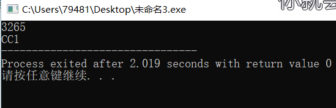
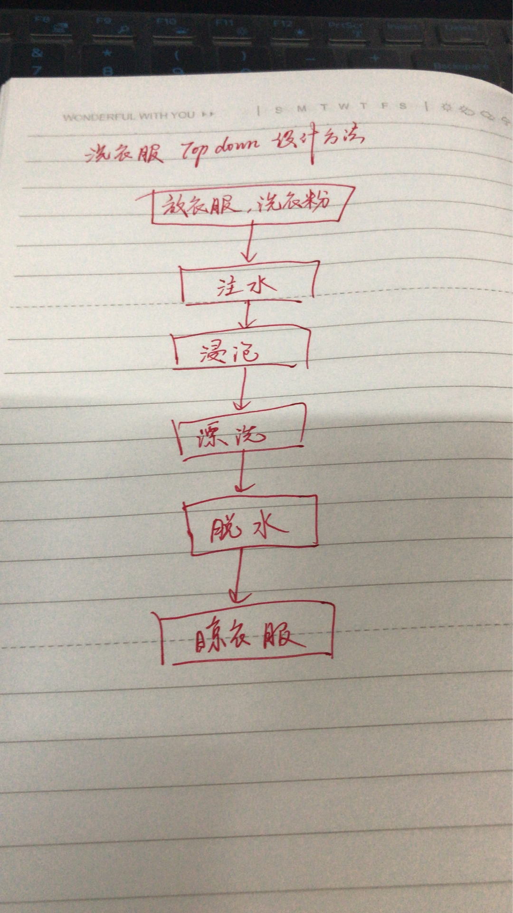

# 1
## 1）用伪代码描述将十进制转换成16进制的方法
``` 
Begin
read x；    //整型数  
init y[]；  //字符数组
init i=0；   
while x/16!=0 
    do  y[i]<-x%16
    if x%16>9 then
         y[i]的值{10，11，12，13，      14，15}对应换成{A,B,C,D,E};
    end if      
    x<-x/16;
    i<-i+1;
end while

将y倒序排列；
print y；
End
```
## 2）C语言实现（先用注释写好算法，然后翻译）

```
/*Begin
read x；    //整型数  
init y[]；  //字符数组
init i=0；   
while x/16!=0 
    do  y[i]<-x%16
    if x%16>9 then
         y[i]的值{10，11，12，13，      14，15}对应换成{A,B,C,D,E};
    end if      
    x<-x/16;
    i<-i+1;
end while

将y倒序排列；
print y；
End
*/
#include<stdio.h>
#include<string.h>

int main(){
	int x;
	scanf("%d",&x);
	char y[10];
	int i=0;
	if(x>=0){
	while(x){
		if(x%16<10)
		y[i]=(char)(x%16+48);
		else		
		switch(x%16){
			case 10:y[i]='A';break;
			case 11:y[i]='B';break;
			case 12:y[i]='C';break;
			case 13:y[i]='D';break;
			case 14:y[i]='E';break;
			case 15:y[i]='F';break;
			}
		x/=16;
		++i;
		}
	int m=strlen(y);
	char res[50];
	for(int j=0;j<m;++j)
		res[j]=y[m-1-j];
			
	printf("%s",res);		
	}
	if(x<0){
			x=-x;
	while(x){
		if(x%16<10)
		y[i]=(char)(x%16+48);
		else		
		switch(x%16){
			case 10:y[i]='A';break;
			case 11:y[i]='B';break;
			case 12:y[i]='C';break;
			case 13:y[i]='D';break;
			case 14:y[i]='E';break;
			case 15:y[i]='F';break;
			}
		x/=16;
		++i;
		}
	int m=strlen(y);
	char res[50];
	for(int j=0;j<m;++j)
		res[j]=y[m-1-j];
			
	printf("-%s",res);		
	}
}


```
## 3）使用 -1,  0,  1,  15,   26，3265 最为输入测试你的程序
测试结果分别为-1，0，1，F，1A，CC1    
如图：(只列举了3265的结果)



# 2、名词解释与对
## 1）Top-down design
Top-down and bottom-up are both strategies of information processing and knowledge ordering, used in a variety of fields including software, humanistic and scientific theories (see systemics), and management and organization. In practice, they can be seen as a style of thinking, teaching, or leadership.  
自上而下和自下而上都是信息处理和知识排序的策略，用于各种领域，包括软件，人文和科学理论（参见系统学），以及管理和组织。在实践中，它们可以被视为一种思维，教学或领导风格。  
## 2） Work breakdown structure (WBS)
Working on project wbs
A work-breakdown structure (WBS)[2] in project management and systems engineering, is a deliverable-oriented breakdown of a project into smaller components.   
从事wbs项目在项目管理和系统工程中，工作分解结构是将项目分解为更小的组件的面向交付的分解。

## 3）简述管理学WBS 与 信息学Top-down设计 的异同
同：都是分解系统以深入了解其组成子系统
异：Top-down是由上到下，WBS根据不同类别分成小的部分

# 3、仔细观察您洗衣机的运作过程，运用Top-down设计方法和Pseudocode 描述洗衣机控制程序


Top-down设计  

## 1）请使用伪代码分解“正常洗衣”程序的大步骤。包括注水、浸泡等
```
BEGIN
    用户选择洗衣模式{标准，快速，大件，干洗。。。}；
    while 水位低于设计水位
        注水；
    end while
    定义计时器time_counter()  ;
    设计浸泡时间t1；
    repeat 浸泡；
    until time_counter(浸泡)>t1;
    设计漂洗时间t2；
    repeat 漂洗；
    until time_counter(漂洗)>t2;
    设计脱水时间t3；
    repeat 脱水；
    until time_counter(脱水)>t3;
    提示结束音响起；
END
```
## 2）进一步用基本操作、控制语句（IF、FOR、WHILE等）、变量与表达式，写出每 个步骤的伪代码
注水
```
BEGIN
    设定水位volume;
    定义三个函数 {
        water_in_switch(open_close) water_out_switch(open_close)   get_water_volume() 
    }
    do water_in_switch open;
    until get_water_volume()>=volume;
    water_in_switch close;
END
```
浸泡
```
BEGIN
    定义计时器time_counter()  ;
        设计浸泡时间t1；
        repeat 浸泡；
        until time_counter(浸泡)>t1;
END
```
漂洗
```
BEGIN
    设计漂洗时间t2；
    定义计时器time_counter()  ;
    定义motor_run(direction)
        repeat 
            if （time_counter()/15）%2
                then motor_run(left)；
            else motor_run(right)；
            endif
        until time_counter(漂洗)>t2;
END
```
脱水
```
BEGIN
    定义motor_run(direction)
    设计脱水时间t3；
    do water_in_switch open;
    until get_water_volume()>=0;
    water_in_switch close;
      //先排水。
    repeat motor_run(left)；
    until time_counter(浸泡)>t3;
    响铃；
END
```

##  3）根据你的实践，请分析“正常洗衣”与“快速洗衣”在用户目标和程序上的异同。 你认为是否存在改进（创新）空间，简单说明你的改进意见？

    快速洗衣不需要浸泡步鄹。
    我的方案不存在改进创新空间！！！
##  4）通过步骤3），提取一些共性功能模块（函数），简化“正常洗衣”程序，使程序 变得更利于人类理解和修改维护。
```
共性功能模块：  
    计时器函数time_counter();  
    动作_时间函数（动作a，时间t）{  
        执行动作使系统至某状态并维持t的时间
    }   
    动作_状态_改变函数（动作a，状态k，动作b）{  
        执行动作a，维持至状态改变，再执行动作b  
    }
```    
这样，程序简化，如脱水步骤只需一个函数：   
    动作_时间函数（电机转动,脱水时间）