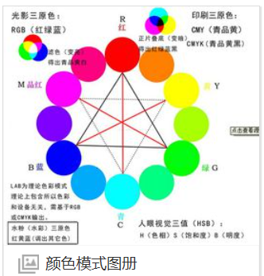
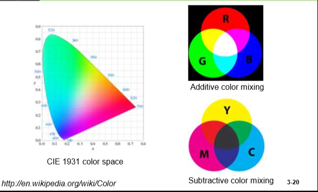
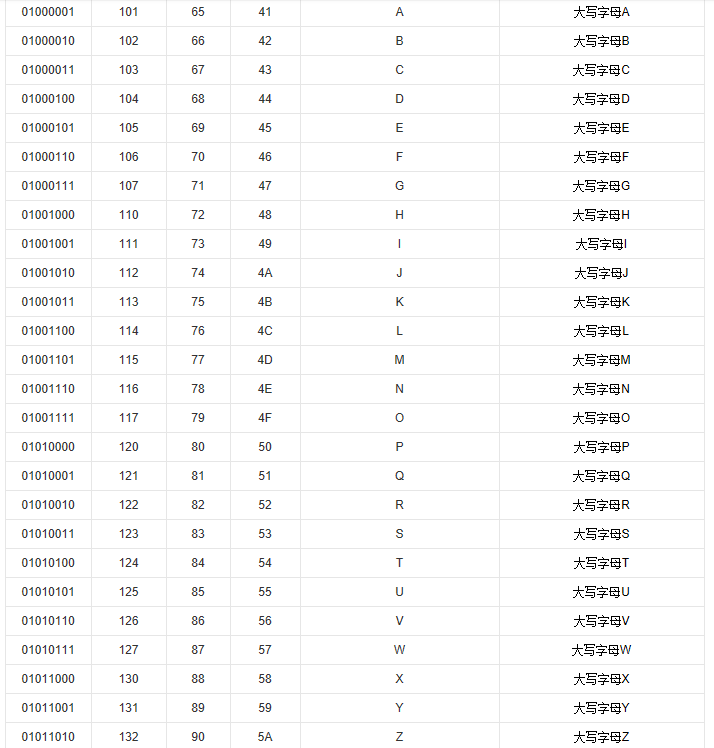

# 色彩表示与编码

颜色的实质是一种光波。它的存在是因为有三个实体：光线、被观察的对象以及观察者

颜色是我们对不同频率的光的感知到达我们眼睛的视网膜。•我们的视网膜有三种颜色的感光细胞，它们可以对不同频率的频率做出反应。这些感光器类别对应着红色、绿色和蓝色的颜色。

## RGB颜色

色彩表示一般使用RGB颜色模式
即三基色红绿蓝，以此三基色互相混合表示成千上万种颜色。

将颜色数字化（digitizing）表示：
RGB：RGB的所谓“多少”就是指亮度，并使用整数来表示。通常情况下，RGB各有256级亮度，每种颜色由8位二进制数字表示，用十进制则表示为从0、1、2...直到255。

按照计算，256级的RGB色彩总共能组合出约1678万种色彩，即256×256×256=16777216。通常也被简称为1600万色或千万色。也称为24位色(2的24次方)。

例如，红色为（255，0，0，）,
也可写为FF0000，(16进制表示)

## 计算机颜色表示

计算机表示颜色也是用二进制。16位色的发色总数是65536色，也就是2的16次方；24位色被称为真彩色，它可以达到人眼分辨的极限，发色数是16777216色，也就是2的24次方。但32位色就并非是2的32次方的发色数，它其实也是16777216色，不过它增加了256阶颜色的灰度也就是8位透明度，发色数其实2的24次方，但是增加了8位透明度，就规定它为32位色。少量显卡能达到36位色，它是24位发色数再加512阶颜色灰度。
至于32位色和16位色肉眼分辨不出来？其实只要打开一张有较大面积渐变色的图案，然后分别把显卡属性的颜色质量调整为16位色和32位色，即可看出二者的差别来

## 位图
光栅图rastergraphics format也叫做位图、点阵图、像素图，简单的说，就是最小单位由像素构成的图‘只有点的信息。缩放时会失真。每个像素有自己的颜色，类似电脑里的图片都是像素图，你把它放很大就会看到点变成小色块了。这种格式的图适合存储图形不规则，而且颜色丰富没有规律的图，比如照相、扫描。 BMP,GIF,JPG等等.格式的文件。重现时，看图软件就根据文件里的点阵绘到屏幕上.或都打印出来。

## 屏幕分辨率

屏幕分辨率是指屏幕显示的分辨率。屏幕分辨率确定计算机屏幕上显示多少信息的设置，以水平和垂直像素来衡量。屏幕分辨率低时（例如 640 x 480），在屏幕上显示的像素少，但尺寸比较大。屏幕分辨率高时（例如 1600 x 1200），在屏幕上显示的像素多，但尺寸比较小。
显示分辨率就是屏幕上显示的像素个数，分辨率160×128的意思是水平方向含有像素数为160个，垂直方向像素数128个。屏幕尺寸一样的情况下，分辨率越高，显示效果就越精细和细腻。

# 字符编码

## [ASCII code](https://baike.baidu.com/item/ASCII/309296?fr=aladdin)

由美国发明，刚开始时，ascii码用7位二进制数字表示每个字母与符号，2^7=128足够表示英文所需的字符。
后来又演变为由8位来表示，称为扩展ascii，用于确定附加的128 个特殊符号字符、外来语字母和图形符号。

如图A至Z的ascii码

## [unicode码](https://baike.baidu.com/item/Unicode)
因为128，256个字符都不够表示汉字（几千个）及其他非英文语种的文字，故国际开始用16位二进制数字表示每个字符，2^16=65536,足够表示世界的所有需要的字符。

而对于原来的ascii码，只在前面添加2个零(16进制下2)，即为unicode码。

### 还有更多的utf-8，utf-7编码形式，此处不再赘述。