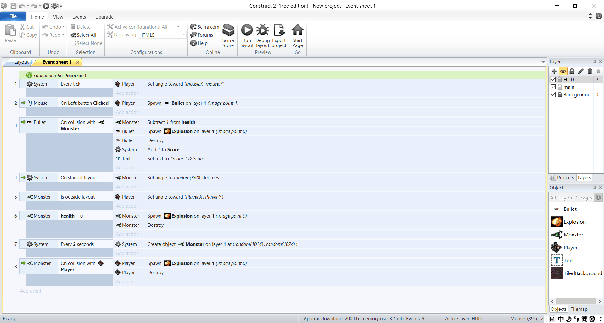
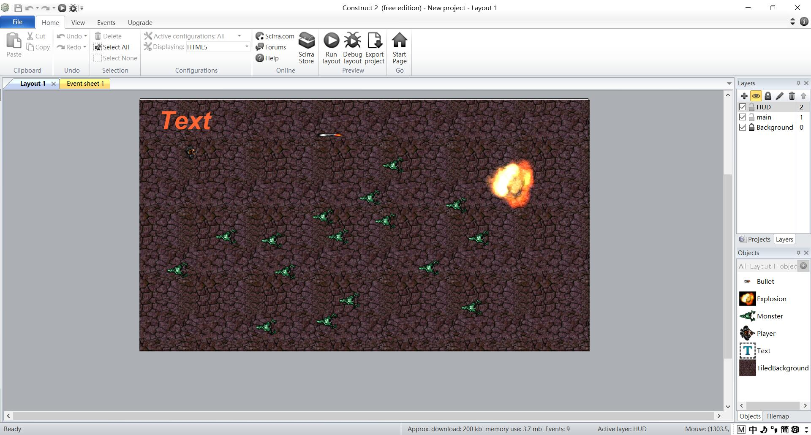
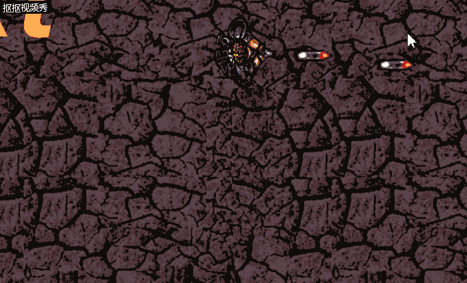

# HTML5小游戏(太空大战)

 

## 1、游戏的策划

### 概念（concept）文档：

楔子：外星怪物入侵地球，而你将被任命为驱逐站队队长与之战斗，保卫地球...  

人设与道具：  
玩家：太空战士，持有巨型高速激光引力子发射器，能够发射反物质子弹。

子弹：在射中敌人的瞬间爆发巨大的能量将外星怪物摧毁。  

外星怪物：浑身绿油油的奇怪生物，会主动向有人的地方靠近，接触人类即爆炸，繁衍速度快，不加紧消灭将很快让地球陷于混乱。

## 2、游戏设计

如图

### crc卡片：
<table>
 
   <tr>
        <td colspan="2">玩家战士</td>    
   </tr>
      <tr>
        <td colspan="2">位于第二层</td>    
   </tr>
      <tr>
        <td>鼠标</td> 
        <td>鼠标移动->跟随鼠标转向</td> 
   </tr>
   <tr>
        <td>子弹</td> 
        <td>点击->发射子弹</td> 
   </tr>
      <tr>
        <td>外星怪物</td> 
        <td>接触->爆炸，摧毁</td> 
   </tr>
         <tr>
        <td>游戏结束图片</td> 
        <td>与外星生物接触->弹出图片</td> 
   </tr>
</table>   
  
<table>
 
   <tr>
        <td colspan="2">外星生物</td>    
   </tr>
      <tr>
        <td colspan="2">位于第二层</td>    
   </tr>

   <tr>
        <td>系统</td> 
        <td>自动向玩家移动靠近</td> 
   </tr>
      <tr>
        <td>子弹</td> 
        <td>接触->爆炸，摧毁</td> 
   </tr>
         <tr>
        <td>游戏结束图片</td> 
        <td>与玩家接触->弹出图片</td> 
   </tr>
</table>
  
<table>
 
   <tr>
        <td colspan="2">分数</td>    
   </tr>
      <tr>
        <td colspan="2">位于第二层</td>    
   </tr>

   <tr>
        <td>子弹</td> 
        <td>子弹接触怪物->分数加1</td> 
   </tr>

</table>

## 游戏展示

