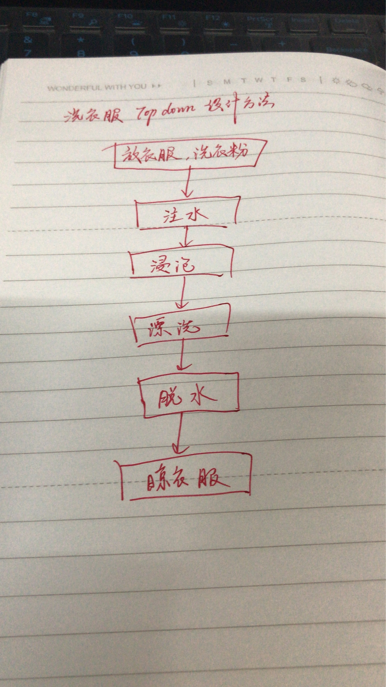

# Top-down的洗衣机设计  
)

## 每 个步骤的伪代码
注水
```
BEGIN
    设定水位volume;
    定义三个函数 {
        water_in_switch(open_close) water_out_switch(open_close)   get_water_volume() 
    }
    do water_in_switch open;
    until get_water_volume()>=volume;
    water_in_switch close;
END
```
浸泡
```
BEGIN
    定义计时器time_counter()  ;
        设计浸泡时间t1；
        repeat 浸泡；
        until time_counter(浸泡)>t1;
END
```
漂洗
```
BEGIN
    设计漂洗时间t2；
    定义计时器time_counter()  ;
    定义motor_run(direction)
        repeat 
            if （time_counter()/15）%2
                then motor_run(left)；
            else motor_run(right)；
            endif
        until time_counter(漂洗)>t2;
END
```
脱水
```
BEGIN
    定义motor_run(direction)
    设计脱水时间t3；
    do water_in_switch open;
    until get_water_volume()>=0;
    water_in_switch close;
      //先排水。
    repeat motor_run(left)；
    until time_counter(浸泡)>t3;
    响铃；
END
```


## 简化
```
共性功能模块：  
    计时器函数time_counter();  
    动作_时间函数（动作a，时间t）{  
        执行动作使系统至某状态并维持t的时间
    }   
    动作_状态_改变函数（动作a，状态k，动作b）{  
        执行动作a，维持至状态改变，再执行动作b  
    }
```    
这样，程序简化，如脱水步骤只需一个函数：   
    动作_时间函数（电机转动,脱水时间）


## 小结
 自顶向下将大步骤分为尽量小的好操作的小步骤  
 再每个步骤检查细节，尽量简化。  
 最后还应该测试所写的程序，以使之符合要求。