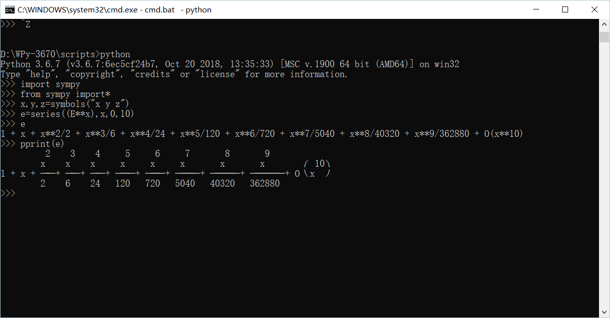
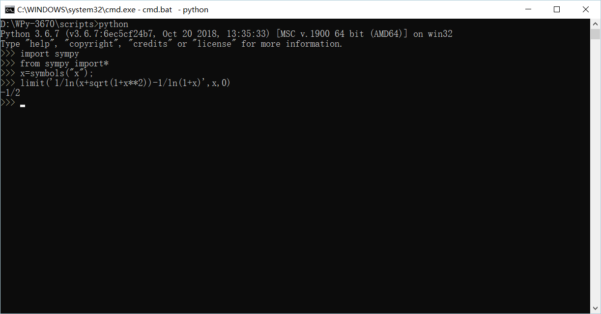
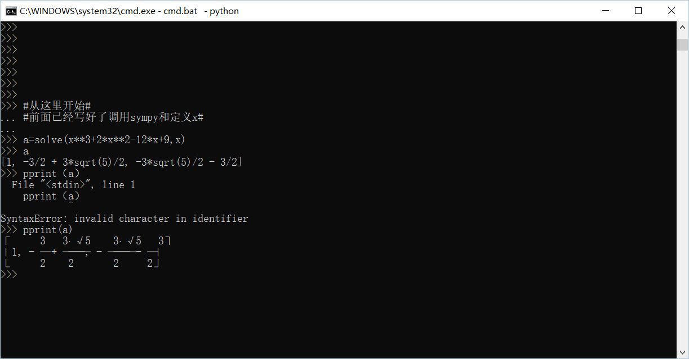
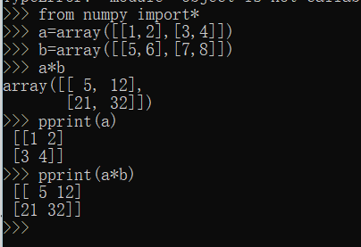
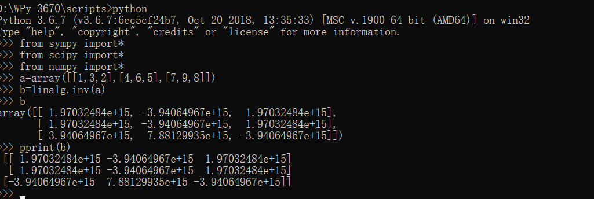

## 1、选择2个高等数学上的作业，如泰勒分解、公式化简、解方程等。 （一般搜索不到有价值的答案）
### 1泰勒分解
将e^x泰勒展开，如图

### 2求极限
如图作业第三题
   
用sympy求解如下
  

### 解方程
 如图求x^3+2*x^2-12x+9=0的解  
 

## 2、选择2个线性代数上的作业，如求dot、逆矩阵等，最好会解方程。（建议阅读《用Python做科学计算》）

### 1用numpy求矩阵相乘

### 2求逆矩阵
求  
|1，3，2|  
|4，6，5|  
|7，9，8|   
的逆矩阵   如图  
 