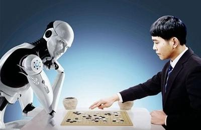
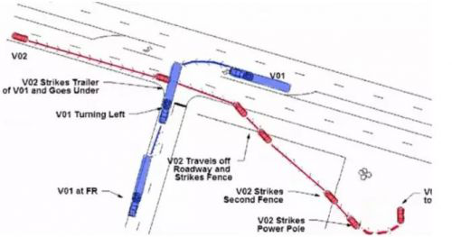
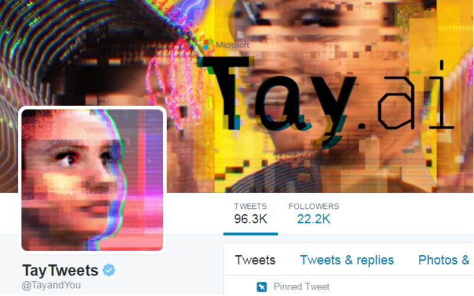
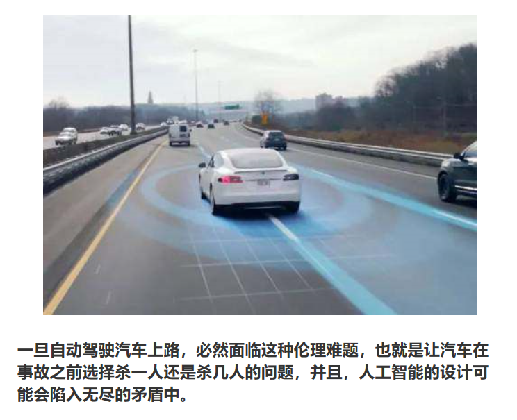

# 关于人工智能伦理道德的几个思考

 

## 思考一：人工智能是否存在思维？

>1）3D活动模拟图在结构上与人脑皮层相同，如果复制后的 “电子人脑”能够产生思维意识，思维的存在是否就是人的存在呢?  
  
>2）在2016年进行的一项调查中，175名行业专家中有90%的人认为，到2075年，人工智能可以达到与人类对等的水平。

## 思考二：人工智能是否会取代人类？或者引发灾难？

### 阿尔法围棋事件

>阿尔法围棋（AlphaGo）是第一个击败人类职业围棋选手、第一个战胜围棋世界冠军的人工智能机器人，由谷歌（Google）旗下DeepMind公司戴密斯·哈萨比斯领衔的团队开发。其主要工作原理是“深度学习”。 
   
>>2016年3月，阿尔法围棋与围棋世界冠军、职业九段棋手李世石进行围棋人机大战，以4比1的总比分获胜；2016年末2017年初，该程序在中国棋类网站上以“大师”（Master）为注册帐号与中日韩数十位围棋高手进行快棋对决，连续60局无一败绩；2017年5月，在中国乌镇围棋峰会上，它与排名世界第一的世界围棋冠军柯洁对战，以3比0的总比分获胜。围棋界公认阿尔法围棋的棋力已经超过人类职业围棋顶尖水平，在GoRatings网站公布的世界职业围棋排名中，其等级分曾超过排名人类第一的棋手柯洁。

## 思考三：有感情有意识的人工智能是否应该享有人权？

>早在前几年，就有人工智能试图从实验室逃跑的案例，可见人工智能拥有自己的意识并不是什么不可能的事。所以是否应当给予人工智能人权成为了一个巨大难题。
    
>约翰·丹纳赫说，“给任何实体赋予法律人格的决定，基本上都可以简单地分为两个子问题。这个实体是否应该被当作道德主体来对待，它应该对自己的行为负责吗？另一个问题是，这个实体是否应该被当作一个道德客体来对待，从而受到保护，免受某些干扰和以及对其完整性的侵害呢？

>自主智能机器人到底在法律上是什么？自然人？法人？动物？物？我们可以虐待、折磨或者杀死机器人吗？  
>>欧盟已经在考虑要不要赋予智能机器人“电子人”的法律人格，具有权利义务并对其行为负责。

## 思考四：谁来为事故负责
>从阿西莫夫提出的机器人三定律到2017年阿西洛马会议提出的23条人工智能原则，AI安全始终是人们关注的一个重点  

>2016年7月，特斯拉无人驾驶汽车发生重大事故，造成了一名司机当场死亡。 

>>这件事故很快成为了新闻媒体的焦点。人们不仅仅关注这件事情本身所带来的影响，更加担心机器作为行为执行主体，发生事故后责任的承担机制。究竟是应该惩罚那些做出实际行为的机器（并不知道自己在做什么），还是那些设计或下达命令的人，或者两者兼而有之。如果机器应当受罚，那究竟如何处置呢？是应当像西部世界中将所有记忆全部清空，还是直接销毁呢？目前还没有相关法律对其进行规范与制约。

>佩罗所说：百分之60到80的错误可以归因于操作员的失误。但当我们回顾一次次错误之时，会发现操作员面临的往往是系统故障中未知甚至诡异的行为方式。我们过去的经验帮不上忙，我们只是事后诸葛亮[15]。

## 思考五：算法歧视与隐私忧虑
>很多AI系统，包括深度学习，都是大数据学习，需要大量的数据来训练学习算法。数据已经成了AI时代的“新石油”。这带来新的隐私忧虑。一方面，如果在深度学习过程中使用大量的敏感数据，这些数据可能会在后续被披露出去，对个人的隐私会产生影响。所以国外的AI研究人员已经在提倡如何在深度学习过程中保护个人隐私。

>之前的一些研究表明，法官在饿着肚子的时候，倾向于对犯罪人比较严厉，判刑也比较重，所以人们常说，正义取决于法官有没有吃早餐。算法也正在带来类似的歧视问题。  

>>一些图像识别软件曾将黑人错误地标记为“黑猩猩”或者“猿猴”。  

>>2016年3月，微软公司在美国的Twitter上上线的聊天机器人Tay在与网民互动过程中，成为了一个集性别歧视、种族歧视等于一身的“不良少女”。
  

>>如果将算法应用在犯罪评估、信用贷款、雇佣评估等关切人身利益的场合，一旦产生歧视，必然危害个人权益。另一方面，深度学习是一个典型的“黑箱”算法，连设计者可能都不知道算法如何决策，要在系统中发现有没有存在歧视和歧视根源，在技术上是比较困难的。

## 伦理困境
>比如，在来不及刹车的情况下，如果自动驾驶汽车往前开就会把三个闯红灯的人撞死，但如果转向就会碰到障碍物使车上的五个人死亡。此时，车辆应当如何选择？在面对类似电车困境的问题时，功利主义和绝对主义会给出不同的道德选择，这种冲突在人类社会都是没有解决的，在自动化的场景下也会遇到这样的问题.  

