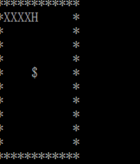

# 13-贪吃蛇
## 字符表示的介绍
>字符表示游戏，本质为写好代码后有键盘输入时清屏刷新输出（包括吃到食物，撞到自己或墙壁gameover）使看起来像贪吃蛇在移动。

## 实现过程：
>1、给定一个10*10的字符矩阵表示蛇的生存空间,其中有一条长度5的蛇(HXXXX)。
 “H”表示蛇头,“X”表示蛇身体。  
 空间中可能有食物（$表示）和障碍物（*表示） 。 
使用“ADWS”按键分别控制蛇的前进方向“左右上下”。  
当蛇头碰到自己的身体或走出边界,游戏结束,否则蛇按你指定方向前进一步。

伪代码：
```
    输出字符矩阵
	WHILE not 游戏结束 DO
		ch＝等待输入
		CASE ch DO
		‘A’:左前进一步，break 
		‘D’:右前进一步，break    
		‘W’:上前进一步，break    
		‘S’:下前进一步，break    
		END CASE
		输出字符矩阵 //(吃到食物则加长)
	END WHILE
	输出 Game Over!!! 
    ```
```
>难点：
清屏函数
随机生成食物的函数（rand）
不按按键时自动向前(kbhit函数)


## 动画展示：



