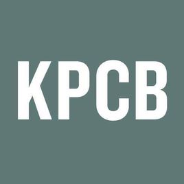
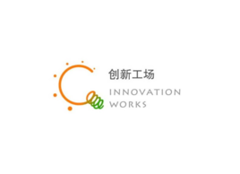

# IT风投之我见
## 例子 

>E诊断获得数千万人民币天使轮融资 E诊断是一个医学影像诊断云服务平台，为患者提供优质的远程医学影像会诊，深度体检，早癌筛查，成本低，效率高，提供医生社交执业APP，随时会诊，隶属于西安沸腾医疗软件科技有限公司，近日 E诊断获得数千万人民币天使轮融资，投资方是西安交通大学资产管理有限公司。  

>易乐学车获得种子轮融资 易乐学车是一家互联网驾校，易乐学车面向的主要用户群体是在校大学生和应往届毕业生团体。 易乐学车在所覆盖的地区高校都有校园负责人，实现O2O驾校模式，近日，易乐学车获得种子轮融资。  

>考试星获得数百万天使轮融资 考试星是一家面向企业的在线考试云平台，向企业用户提供在线服务，无需企业自己具有专业技术人员、服务器、网络等软硬件条件，可用于企业培训后考试、招聘笔试等，满足企业培训考试信息化的需求。北京梦见星科技有限公司旗下产品，近日，考试星获得数百万天使轮融资，投资方暂未透漏。  

>大街网获得一亿人民币D+轮融资 大街网是一个社会化招聘网站及职业社交网络，隶属于北京大杰致远信息技术有限公司，近日，大街网获得一亿人民币D+轮融资，由文轩资本领投，北极光创投，创始人susan跟投。

(作者：akanine 
来源：CSDN 
原文：https://blog.csdn.net/akanine/article/details/78846119 )

--------------------- 

## 投资风险
>风险投资(Venture Capital)简称是VC，在中国是一个约定俗成的具有特定内涵的概念，其实把它翻译成创业投资更为妥当。广义的风险投资泛指一切具有高风险、高潜在收益的投资;狭义的风险投资是指以高新技术为基础，生产与经营技术密集型产品的投资。根据美国全美风险投资协会的定义，风险投资是由职业金融家投入到新兴的、迅速发展的、具有巨大竞争潜力的企业中一种权益资本。

## 可以说it产业是目前投资行业的宠儿 当今互联网时代 牢牢把握IT走向的风投产业都成为了dalao