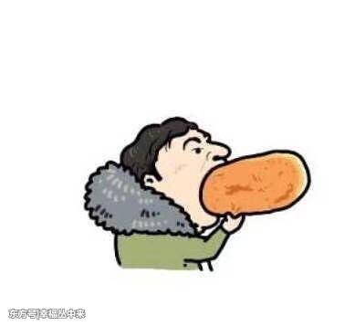
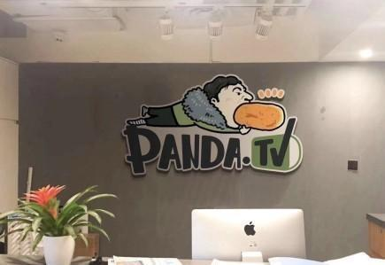

# 互联网时代的盈利模式
## 1、关于流量

### 流量意味着体量，体量意味着分量。
### 免费往往是获取流量首要策略。
### 
### 量变才能引起质变，质变才能变现！
  
## 流量的本质是用户关注度

>当你源源不断的受到关注时，您便成为一个“窗口”，金钱自会随之而来，流量自会转为商业价值。
## 流量是所有商业模式得以改进的基础，缺乏流量基础则一切无从谈起！

>例如京东、1号店、一样做了好多年电商都不是很赚钱，都是在花钱咋流量。而其流量达到一定规模的时候，也就意味着其拥有足够大的体量，也就是更多的社会资源。流量意味着体量，体量意味着分量。这就是流量所带来的价值。

>顶级流量王王思聪带动的流量 

 
 >王思聪吃热狗，还曾被美术生用来做素描联系对象

>>IG俱乐部官博换过这张动漫形象的头像，王思聪公司用这个做了公司形象的装饰！如今看王思聪投资的直播平台熊猫直播，里面就有送热狗的选项，就是王思聪这个吃热狗的动漫形象！

有业内人士认为，王思聪这波热点事件+热点人物+巨额奖金的营销方式起到了现象级的传播效应，以一人之力秒杀了206万转发量的“锦鲤营销”。

##分类：根据具体的行业类型和功能特性，对互联网的商业模式进行分类，可以分为十大主要的商业模式：
---------------
>1。传统门户：典型的企业如：新浪、网易、搜狐等。   
>2.垂直门户​：例如：搜房网、携程网等专业网站。   
>3.​电子商务：例如：亚马逊、阿里巴巴、 京东、苏宁等。   
4.网络通讯：例如我们日常生活中最熟悉的QQ、MSN等。   
5.搜索引擎：例如百度、谷歌等。   
6.休闲娱乐：例如爱奇艺、搜狐视频等。   
7.生活服务：例如嘀嘀打车、美团外卖等。   
8.无线增值：例如借贷宝、同花顺等。  
9.社区交友：例如人人网、陌陌等。   
10.导航/资讯：例如QQ网址导航、凤凰资讯网等。  

>>这十大商业模式不仅包含了当今互联网时代下的盈利模式，更包含了一种经营发展的思想，在IT产业的推动下，我们有理由期待未来的互联网商业模式能够更丰富、更完善
